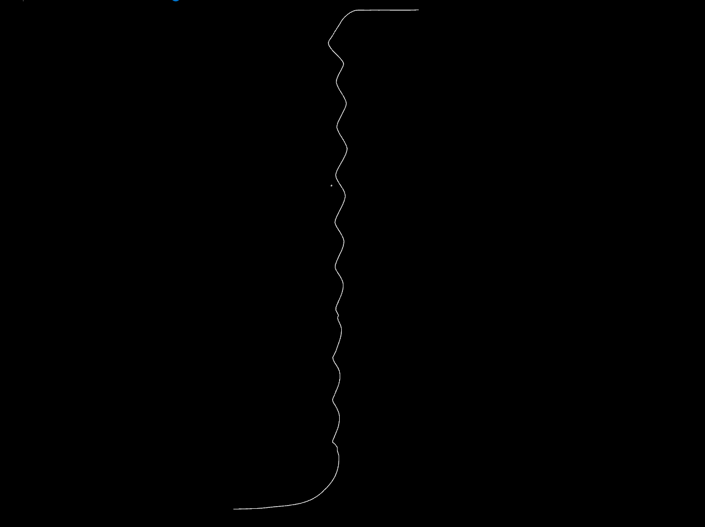
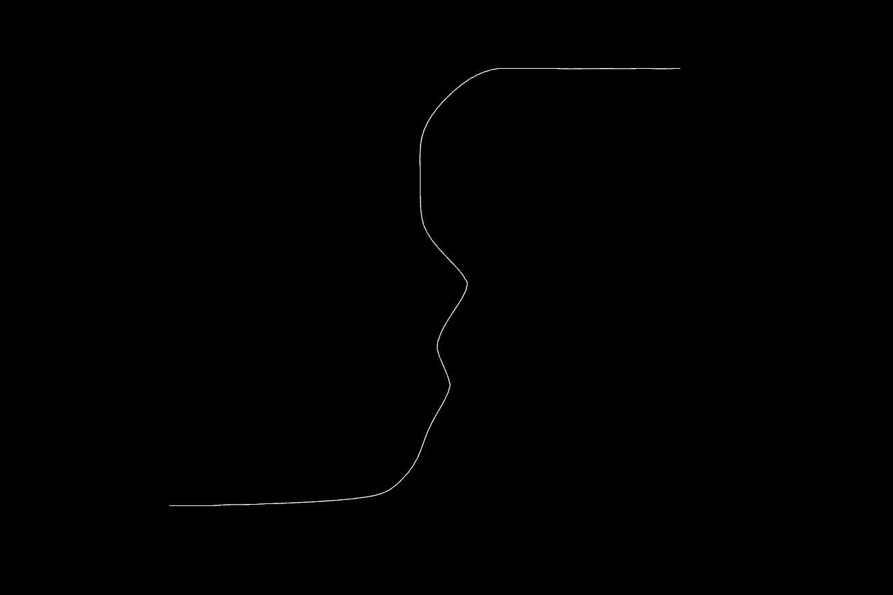

### Setup

- install pipenv if not already installed using `pip install pipenv`

- setup up virtual env and install dependencies using `pipenv shell` followed by `pipenv install`

- command to run `pipenv run python3 test.py -D 2 config.txt`

### Run configuration

- to change any initial params, edit confix.txt file

- for time dependent etching, modify paramters `noise_factor` in function `time_depndendent_etching`. By default `noise_factor = 0` which means no dependence on time 

### Results with simple cycle dependent etching

1. Without time variation (noise_factor = 0)

2. With time variation (noise_factor = 1)

